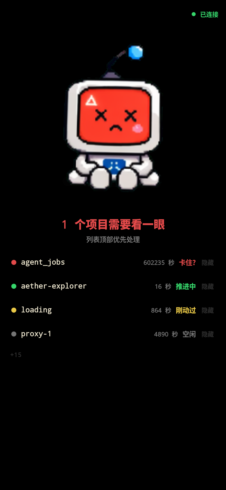
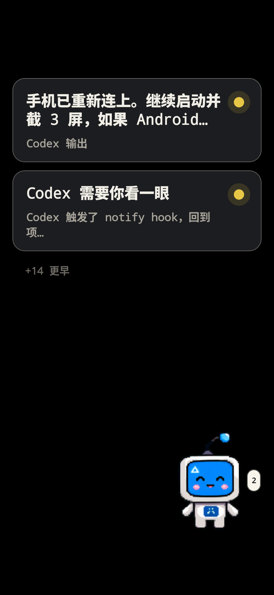
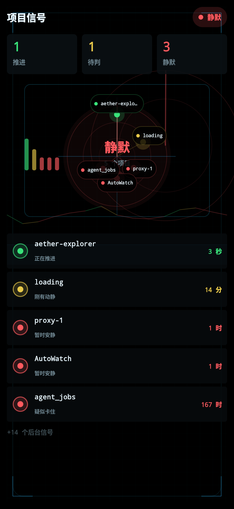

# Codex 守望台 / Codex Watchtower

把一台旧 Android 手机变成 Codex 项目状态守望台。  
Mac companion 读取本机 Codex 结构化状态并广播，Android 展示桌宠、动态流和项目信号 HUD，帮助你在多项目并行时快速判断是否需要介入。

## 普通用户安装

Codex 守望台需要两个 App 配合：

1. Mac 上运行 `Codex Watchtower.app`，负责读取本机 Codex 状态并通过 BLE/HTTP 广播。
2. Android 手机上安装 `CodexWatchtower.apk`，负责显示桌宠、动态和项目信号。

下载地址见 GitHub Releases：

```text
https://github.com/HaoRangQi/CodexWatchtower/releases
```

首次使用：

1. 下载 `CodexWatchtower-macOS.zip`，解压后打开 `Codex Watchtower.app`，按 macOS 提示允许蓝牙权限。
2. 下载 `CodexWatchtower.apk`，复制到 Android 手机并安装；如系统拦截，允许“安装未知来源应用”。
3. 手机打开 `Codex 守望台`，授予附近设备/蓝牙权限，右上角显示 `已连接` 即可。
4. 保持 Mac 和 Android 在附近；BLE 优先，HTTP fallback 用于同局域网调试。

开发者从源码构建见 [运行与调试手册](docs/RUNBOOK.md)。

## 三屏预览

<table>
  <tr>
    <td></td>
    <td></td>
    <td></td>
  </tr>
  <tr>
    <td align="center">第一屏：桌宠总览</td>
    <td align="center">第二屏：宠物动态</td>
    <td align="center">第三屏：项目信号 HUD</td>
  </tr>
</table>

## 文档入口

- 文档导航：`docs/README.md`
- 运行与调试手册：`docs/RUNBOOK.md`
- 协议契约：`PROTOCOL.md`
- 架构基线：`docs/current/ARCHITECTURE.md`
- 文档治理：`docs/GOVERNANCE.md`
- ADR 索引：`docs/adr/README.md`

## 致谢

致谢：vibe by codex。

## 二期

二期：待施工。
